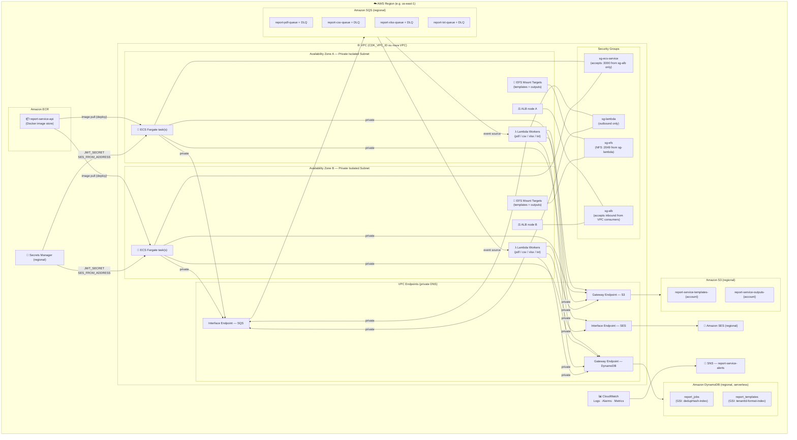

# Report Service

Microserviço de geração de relatórios — NestJS REST API (ECS Fargate) + 4 workers Lambda SQS + DynamoDB + S3 Files + SES.

## Visão Geral

```
Internal Service → ALB interno → ECS Fargate (NestJS REST API)
                                    ↓ dedup hash (SHA-256)
                                    ↓ publica na fila correta
           ┌───────────────────────────────────┐
    SQS PDF Queue   SQS CSV   SQS XLSX   SQS TXT
           ↓            ↓         ↓          ↓
    pdf-worker    csv-worker xlsx-worker txt-worker     (Lambda + EFS mount)
           ↓ (NestJS Standalone App)
    /mnt/templates (S3 Files NFS read-only)
    /mnt/outputs   (S3 Files NFS read-write)
           ↓
    SES → Email com link de download (presigned URL 24h)
```

- **API REST**: NestJS rodando em **ECS Fargate** (Docker), atrás de **ALB interno**, com auto-scaling 2-10 tasks
- **Workers**: 4 **Lambdas SQS** (PDF/CSV/XLSX/TXT) com EFS mount para S3 Files

## Arquitetura — Diagrama de Componentes

```mermaid
flowchart TB
    CLIENT["🏢 Internal Service\n(consumer VPC)"]

    subgraph VPC["🌐 VPC — Private Isolated Subnets (2 AZs)"]
        ALB["⚖️ Internal ALB\nport 80\n(internet-facing: false)"]

        subgraph ECS_CLUSTER["ECS Fargate Cluster — report-service"]
            API["🐳 NestJS REST API\n256 vCPU / 512 MB\nauto-scaling: 2–10 tasks"]
        end

        subgraph LAMBDAS["Lambda Workers (ARM64 / Node 20)"]
            PDF_W["λ pdf-worker\n1 536 MB · 5 min · concurrency 5"]
            CSV_W["λ csv-worker\n512 MB · 3 min · concurrency 10"]
            XLSX_W["λ xlsx-worker\n1 024 MB · 3 min · concurrency 8"]
            TXT_W["λ txt-worker\n256 MB · 30 s · concurrency 20"]
        end

        subgraph EFS_FS["EFS File Systems (encrypted)"]
            EFS_TPL["📂 Templates FS\n/mnt/templates\n(read-only AP)"]
            EFS_OUT["📂 Outputs FS\n/mnt/outputs\n(read-write AP)"]
        end

        subgraph VPC_EP["VPC Endpoints (private traffic)"]
            EP_S3["Gateway: S3"]
            EP_DDB["Gateway: DynamoDB"]
            EP_SQS["Interface: SQS"]
            EP_SES["Interface: SES"]
        end
    end

    subgraph QUEUES["☁️ Amazon SQS (KMS-managed encryption)"]
        SQS_PDF["📨 report-pdf-queue\n↳ DLQ: report-pdf-dlq\nvisibility: 360 s"]
        SQS_CSV["📨 report-csv-queue\n↳ DLQ: report-csv-dlq\nvisibility: 120 s"]
        SQS_XLSX["📨 report-xlsx-queue\n↳ DLQ: report-xlsx-dlq\nvisibility: 180 s"]
        SQS_TXT["📨 report-txt-queue\n↳ DLQ: report-txt-dlq\nvisibility: 60 s"]
    end

    subgraph DYNAMO["☁️ Amazon DynamoDB (PAY_PER_REQUEST · PITR)"]
        DYN_JOBS["📋 report_jobs\nPK: jobId\nGSI: dedupHash-index\nTTL: expiresAt"]
        DYN_TPL["📋 report_templates\nPK: templateId · SK: version\nGSI: tenantId-format-index"]
    end

    subgraph S3_BUCKETS["☁️ Amazon S3 (encrypted · Block Public)"]
        S3_TPL["🪣 report-service-templates-{account}\n(versioned)"]
        S3_OUT["🪣 report-service-outputs-{account}\n(lifecycle: 30d→IA · 90d→Glacier · 365d expire)"]
    end

    ECR["🐳 Amazon ECR\nreport-service-api\n(keep last 10 images)"]
    SES["📧 Amazon SES\npresigned URL e-mail (24 h)"]
    SM["🔐 Secrets Manager\njwtSecret · sesFromAddress"]
    SNS["🔔 SNS Topic\nreport-service-alerts"]
    CW["📊 CloudWatch\nAlarms · Logs · Metrics\n(Lambda Powertools)"]

    %% ── Request path ──────────────────────────────────
    CLIENT -->|"HTTP (in-VPC)"| ALB
    ALB -->|"port 3000"| API

    %% ── API → data layer ──────────────────────────────
    API -->|"dedup SHA-256\nPutItem / GetItem"| DYN_JOBS
    API -->|"GetItem (template lookup)"| DYN_TPL
    API -->|"GetObject (check output)"| S3_OUT

    %% ── API → queues ──────────────────────────────────
    API -->|"SendMessage"| SQS_PDF
    API -->|"SendMessage"| SQS_CSV
    API -->|"SendMessage"| SQS_XLSX
    API -->|"SendMessage"| SQS_TXT

    %% ── Queues → workers ──────────────────────────────
    SQS_PDF -->|"SQS trigger (batch=1)"| PDF_W
    SQS_CSV -->|"SQS trigger (batch=1)"| CSV_W
    SQS_XLSX -->|"SQS trigger (batch=1)"| XLSX_W
    SQS_TXT -->|"SQS trigger (batch=1)"| TXT_W

    %% ── Workers → EFS ─────────────────────────────────
    PDF_W & CSV_W & XLSX_W & TXT_W -->|"read template"| EFS_TPL
    PDF_W & CSV_W & XLSX_W & TXT_W -->|"write output"| EFS_OUT

    %% ── Workers → data layer ──────────────────────────
    PDF_W & CSV_W & XLSX_W & TXT_W -->|"UpdateItem (DONE/FAILED)"| DYN_JOBS
    PDF_W & CSV_W & XLSX_W & TXT_W -->|"GetObject (template)"| S3_TPL
    PDF_W & CSV_W & XLSX_W & TXT_W -->|"PutObject (output)"| S3_OUT

    %% ── Workers → SES ─────────────────────────────────
    PDF_W & CSV_W & XLSX_W & TXT_W -->|"SendEmail\n(presigned URL 24 h)"| SES

    %% ── Secrets / Image ───────────────────────────────
    ECR -->|"pull image on deploy"| API
    SM -->|"JWT_SECRET\nSES_FROM_ADDRESS"| API

    %% ── Observability ─────────────────────────────────
    SQS_PDF & SQS_CSV & SQS_XLSX & SQS_TXT -->|"DLQ depth alarm"| CW
    CW -->|"alarm action"| SNS
    API -->|"logs /ecs/report-service-api"| CW
    PDF_W & CSV_W & XLSX_W & TXT_W -->|"error-rate alarm"| CW
```



## Visualização de Deploy na AWS

O diagrama abaixo mostra onde cada componente é implantado dentro da conta AWS e como as camadas se organizam na infraestrutura.



### Resumo de onde cada componente fica na AWS

| Componente | Serviço AWS | Localização |
|---|---|---|
| REST API (NestJS) | ECS Fargate | Private Isolated Subnets (2+ AZs), dentro da VPC |
| Load Balancer | Application Load Balancer (interno) | Private Isolated Subnets (2 AZs), `internet-facing: false` |
| Workers PDF/CSV/XLSX/TXT | Lambda (ARM64, Node 20) | Private Isolated Subnets (VPC-attached, acesso a EFS) |
| Imagem Docker | Amazon ECR | Regional (fora da VPC) |
| Filas + DLQs | Amazon SQS (KMS) | Regional (acessado via VPC Endpoint Interface) |
| Banco de jobs | DynamoDB `report_jobs` | Regional (acessado via VPC Endpoint Gateway) |
| Banco de templates | DynamoDB `report_templates` | Regional (acessado via VPC Endpoint Gateway) |
| Templates (arquivos) | Amazon S3 `report-service-templates-{account}` | Regional (acessado via VPC Endpoint Gateway) |
| Outputs (arquivos) | Amazon S3 `report-service-outputs-{account}` | Regional (acessado via VPC Endpoint Gateway) |
| Mount templates | Amazon EFS (Access Point `/templates`) | Mount targets nas Private Subnets |
| Mount outputs | Amazon EFS (Access Point `/outputs`) | Mount targets nas Private Subnets |
| Envio de e-mail | Amazon SES | Regional (acessado via VPC Endpoint Interface) |
| Segredos (JWT, SES) | AWS Secrets Manager | Regional (injetado no ECS container) |
| Alertas | SNS `report-service-alerts` | Regional |
| Monitoramento | CloudWatch Logs + Alarms + Metrics | Regional |

## Pré-requisitos

- Node.js 20+, npm 10+
- AWS CLI v2 configurado
- AWS CDK v2: `npm install -g aws-cdk`
- Docker (para desenvolvimento local com MiniStack)

## Desenvolvimento Local

```bash
# 1. Instalar dependências
npm install

# 2. Subir MiniStack
docker-compose up -d

# 3. Seeder de templates
npm run seed:local

# 4. Subir servidor NestJS local
LOCAL=true JWT_SECRET=dev-secret npm run start:dev
```

## Estrutura do Projeto

```
src/
  core/             ← Config, Auth, Exception Filter, Observability, AppModule
  commons/          ← Types, Errors, Utils, AWS Clients compartilhados
  features/
    reporting/      ← API de relatórios + repositórios + orquestração
    health/         ← Endpoint /health para target group do ALB
  engines/          ← Strategy pattern por formato (core + pdf/csv/xlsx/txt)
  workers/
    core/           ← BaseWorker + WorkerApp factory
    handlers/       ← Entry points Lambda SQS por formato
  mail/             ← MailService com Handlebars + SES
  main.ts           ← Entry point do servidor NestJS (ECS Fargate)
infra/              ← CDK stacks (Core, Storage, Handler/ECS, Workers, Observability)
Dockerfile          ← Multi-stage build da API NestJS (Alpine + non-root)
fixtures/           ← Templates de exemplo para desenvolvimento local
scripts/            ← seed-local.ts, ministack-init.sh
```

### Convenção de nomes de arquivos

- `kebab-case` com sufixo semântico:
  - `*.module.ts`, `*.service.ts`, `*.controller.ts`
  - `*.repository.ts`, `*.worker.ts`, `*.handler.ts`
  - `*.types.ts`, `*.errors.ts`

### Adicionar novo formato de relatório

1. Adicionar `NOVO_FORMATO` em `src/commons/types/job.types.ts` (enum ReportFormat)
2. Criar `src/engines/{formato}/{formato}.engine.ts` implementando `IReportEngine`
3. Registrar no `src/engines/engines.module.ts`
4. Adicionar `SQS_NOVO_QUEUE_URL` no schema do `ConfigService` em `src/core/config/config.service.ts`
5. Criar `src/workers/handlers/{formato}.worker.ts` e adicionar build script no `package.json`
6. Adicionar fila + worker no CDK `WorkersStack`

## API

### `POST /reports/generate`

```json
{
  "format": "PDF",
  "templateId": "financial-report",
  "params": { "reportTitle": "Relatório Abril", "rows": [] },
  "recipientEmail": "user@example.com",
  "recipientName": "João Silva",
  "locale": "pt-BR"
}
```

**Responses:**
- `202` — Job enfileirado: `{ jobId, status: "PENDING", message }`
- `200` — Cache hit: `{ jobId, status: "DONE", downloadUrl, expiresAt }`
- `400` — Validação falhou
- `401` — JWT inválido ou ausente
- `404` — Template não encontrado

### `GET /reports/:jobId/status`

```json
{ "jobId": "...", "status": "DONE", "downloadUrl": "https://...", "format": "PDF", "createdAt": "..." }
```

## Deduplicação

```
SHA-256(tenantId | userId | format | templateId | SHA-256(canonical(params)))
```

- `DONE` → retorna presigned URL (200), sem re-processar
- `PENDING/PROCESSING` → retorna jobId existente (202)
- Novo → cria job e enfileira (202)

## Templates

| Formato | Path no mount |
|---------|--------------|
| PDF | `/mnt/templates/pdf/{templateId}/{version}.hbs` |
| CSV | `/mnt/templates/csv/{templateId}/{version}.json` |
| XLSX | `/mnt/templates/xlsx/{templateId}/{version}.xlsx` |
| TXT | `/mnt/templates/txt/{templateId}/{version}.hbs` |
| Email | `/mnt/templates/mail/{mailTemplateId}/{locale}.hbs` |

```bash
# Upload de templates sem redeploy
aws s3 sync fixtures/templates/ s3://report-service-templates-{account}/
```

## Deploy

**API (ECS Fargate):**
```bash
# 1. Build & push Docker image para ECR
docker build -t report-service-api .
aws ecr get-login-password | docker login --username AWS --password-stdin <account>.dkr.ecr.<region>.amazonaws.com
docker tag report-service-api:latest <account>.dkr.ecr.<region>.amazonaws.com/report-service-api:latest
docker push <account>.dkr.ecr.<region>.amazonaws.com/report-service-api:latest

# 2. Force new deployment do ECS service (pega a imagem :latest)
aws ecs update-service --cluster report-service --service report-service-api --force-new-deployment
```

**Workers (Lambda):**
```bash
npm run build:lambdas
cd infra && npm install && cdk deploy ReportServiceWorkers
```

**Infra completa (primeira vez):**
```bash
# É preciso ter pelo menos uma imagem em ECR antes do primeiro deploy do HandlerStack
cd infra && cdk deploy ReportServiceCore ReportServiceStorage
# ... build & push da imagem (ver passos acima) ...
cdk deploy --all
```

## Variáveis de Ambiente

Veja `.env.example` para a lista completa.

## Testes

```bash
npm test          # vitest run
npm run test:cov  # com coverage
```
